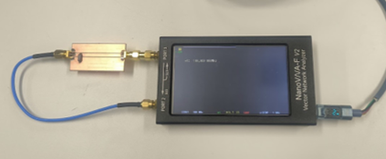

# NanoVNA-F v2 でインピーダンス測定



## 実行方法
このリポジトリをクローンしてから
```bash
streamlit run app.py
```
を実行するとウェブアプリが立ち上がります。

## NanoVNA-F v2 仕様

NanoVNA-F v2 SYSJOINTが開発した、２万円程度で購入可能な小型のベクトルネットワークアナライザです。

- **周波数範囲:** 50 kHz ~ 3 GHz
- **測定ポート:** PORT1 (S11)、PORT2 (S21)
- **S11 ダイナミックレンジ：** 50dB
- **S21 ダイナミックレンジ：** 70dB
- **スイープ点:** 11 ~ 301 ポイント

## VNA (Vector Network Analyzer) の基礎

### 測定原理

VNA は、被測定デバイスに高周波信号を入射し、反射波と透過波の **振幅** と **位相** を測定します。これにより、DUTの周波数特性を複素数として取得できます。

```
         入射波 (a1)         透過波 (b2)
    Port1 ---------> DUT ----------> Port2
            |
         反射波 (b1)
```

### 測定量

- **入射波 (a1):** Port1 から DUT に入射する波
- **反射波 (b1):** DUT から Port1 に戻る波
- **透過波 (b2):** DUT を透過して Port2 に到達する波

これらの測定値から、**Sパラメータ** を算出する。

---

## Sパラメータ

### Sパラメータとは

Sパラメータは、高周波回路における信号の散乱特性を表す指標です。特に2ポート回路では、以下の4つのSパラメータが定義されます:

$$
\begin{bmatrix}
b_1 \\
b_2
\end{bmatrix}
=
\begin{bmatrix}
S_{11} & S_{12} \\
S_{21} & S_{22}
\end{bmatrix}
\begin{bmatrix}
a_1 \\
a_2
\end{bmatrix}
$$


| パラメータ | 意味 | 測定条件 |
|-----------|------|---------|
| **S11** | 入力反射係数 | Port2 を整合終端した状態で Port1 から測定 |
| **S21** | 順方向透過係数 | Port2 を整合終端した状態で Port1→Port2 の透過を測定 |
| **S12** | 逆方向透過係数 | Port1 を整合終端した状態で Port2→Port1 の透過を測定 |
| **S22** | 出力反射係数 | Port1 を整合終端した状態で Port2 から測定 |

**S11 (反射係数):**

$$
S_{11} = \frac{b_1}{a_1} = \frac{反射波}{入射波}
$$

S11 は、入力ポートでの反射の大きさを示します。理想的には S11 = 0 (全ての電力が透過・吸収) が望ましく、S11 = 1 は全反射を意味します。

**S21 (透過係数):**

$$
S_{21} = \frac{b_2}{a_1} = \frac{透過波}{入射波}
$$

S21 は、Port1 から Port2 への信号の伝達率を表します。フィルタやアンプの利得・損失を評価する際に用います。
Sパラメータは次の式のように **複素数** として測定されます。

$$
S_{ij} = |S_{ij}| \cdot e^{j\phi_{ij}} = \text{Re}(S_{ij}) + j \cdot \text{Im}(S_{ij})
$$

- **実部 (Re):** 同相成分
- **虚部 (Im):** 直交位相成分
- **絶対値 (|S|):** 振幅比
- **位相 (φ):** 位相差 [rad または deg]

NanoVNA からは、Sパラメータの実部と虚部が浮動小数で別々にUSB UART経由で出力されます。

---

## インピーダンス測定法

### 1. 反射法

**測定構成:**

```
    Port1 ---[DUT]--- GND
```

Port1 に DUT を接続し、S11 (反射係数) を測定します。


反射係数 Γ = S11 と特性インピーダンス Z0 の関係から、DUT のインピーダンス Z は次式で求まります:

$$
\Gamma = S_{11} = \frac{Z - Z_0}{Z + Z_0}
$$

これを Z について解くと:

$$
Z = Z_0 \cdot \frac{1 + S_{11}}{1 - S_{11}}
$$

**適用範囲:**

- インピーダンスが **Z0 付近 (数Ω ~ 数百Ω)** の測定に適する
- DUT が **終端負荷** として接続される場合
- 開放 (OPEN) や短絡 (SHORT) などの極端な値では精度が低下する

---

### 2. シャントスルー法

**測定構成:**

```
    Port1 ---+--- Port2
             |
           [DUT]
             |
            GND
```

Port1 と Port2 の間に DUT を **並列接続** して S21 (透過係数) を測定します。


並列接続された DUT の ABCD パラメータは:

$$
\begin{bmatrix}
A & B \\
C & D
\end{bmatrix}
=
\begin{bmatrix}
1 & 0 \\
\frac{1}{Z} & 1
\end{bmatrix}
$$


ABCD パラメータを S パラメータに変換すると:

$$
S_{21} = \frac{2Z}{2Z + Z_0}
$$

これを Z について解くと:

$$
Z = \frac{Z_0}{2} \cdot \frac{S_{21}}{1 - S_{21}}
$$

**適用範囲:**

- **低インピーダンス (< 50 Ω)** の測定に有効
- S21 ≈ 1 (DUT が高インピーダンス) の場合、分母がゼロに近づき精度が悪化する

---

### 3. シリーズスルー法

**測定構成:**

```
    Port1 ---[DUT]--- Port2
```

Port1 と Port2 の間に DUT を **直列接続** して S21 を測定します。


直列接続された DUT の ABCD パラメータは:

$$
\begin{bmatrix}
A & B \\
C & D
\end{bmatrix}
=
\begin{bmatrix}
1 & Z \\
0 & 1
\end{bmatrix}
$$


ABCD → S 変換により:

$$
S_{21} = \frac{2Z_0}{2Z_0 + Z}
$$

これを Z について解くと:

$$
Z = 2Z_0 \left( \frac{1}{S_{21}} - 1 \right)
$$

**適用範囲:**

- **高インピーダンス (> 50 Ω)** の測定に有効
- インダクタや高抵抗の測定に適する
- S21 ≈ 0 (DUT が短絡状態) の場合、ゼロ割りが発生するため精度が悪化する

---

### 各測定法の比較

| 測定法 | 使用パラメータ | 測定構成 | 適用範囲 | 主な用途 |
|-------|-------------|---------|---------|---------|
| **反射法** | S11 | DUT を Port1 に接続 | Z0 付近 (10 ~ 500 Ω) | アンテナ、終端抵抗 |
| **シャントスルー法** | S21 | DUT を Port1-Port2 間に並列接続 | 低インピーダンス (< 50 Ω) | コンデンサ、低抵抗 |
| **シリーズスルー法** | S21 | DUT を Port1-Port2 間に直列接続 | 高インピーダンス (> 50 Ω) | インダクタ、高抵抗 |

**推奨事項:**

- 測定対象のインピーダンスが不明な場合は、反射法 (S11) を最初に試す
- 低インピーダンスの精密測定にはシャントスルー法を用いる
- 高インピーダンスの精密測定にはシリーズスルー法を用いる

---

## キャリブレーション

**キャリブレーション手順（1decadeにおける操作）:**

1. `cal reset` - キャリブレーションデータをクリア
2. OPEN を Port1 に接続し、2~3回スイープを待つ
3. `cal open` - OPEN キャリブレーション実行
4. SHORT を Port1 に接続し、2~3回スイープを待つ
5. `cal short` - SHORT キャリブレーション実行
6. LOAD (50 Ω) を Port1 に接続し、2~3回スイープを待つ
7. `cal load` - LOAD キャリブレーション実行
8. Port1 と Port2 を直結し、2~3回スイープを待つ (S21 測定の場合)
9. `cal thru` - THRU キャリブレーション実行
10. `cal done` - キャリブレーション完了
11. `cal on` - キャリブレーションを適用


**周波数帯域別のキャリブレーション:**

広帯域測定 (100 kHz ~ 1 GHz) を行うには、各帯域ごとに上記の手順を実行してキャリブレーションデータを保存してある必要があります。

- スロット 0: 100 kHz ~ 1 MHz
- スロット 1: 1 MHz ~ 10 MHz
- スロット 2: 10 MHz ~ 100 MHz
- スロット 3: 100 MHz ~ 1 GHz

---

## 周波数掃引の種類

### 線形掃引 (Linear Sweep)

周波数を等間隔で掃引します。

$$
f_i = f_{\text{start}} + \frac{i}{N-1} \cdot (f_{\text{stop}} - f_{\text{start}}), \quad i = 0, 1, \dots, N-1
$$

**特徴:**
- 全周波数で均等な測定密度
- 狭帯域測定に適する
- 例: 100 MHz ~ 200 MHz を 101 点測定

**NanoVNA コマンド:**

```
scan 100000000 200000000 101 7
```

### 対数掃引 (Logarithmic Sweep)

周波数を対数間隔で掃引します。

$$
f_i = f_{\text{start}} \cdot \left( \frac{f_{\text{stop}}}{f_{\text{start}}} \right)^{\frac{i}{N-1}}, \quad i = 0, 1, \dots, N-1
$$

**特徴:**
- 低周波数で密、高周波数で疎な測定密度
- 広帯域測定に適する (例: 100 kHz ~ 1 GHz)
- 対数軸プロットでの視認性が向上

NanoVNA-F V2 は対数掃引コマンドを持たないため、本プロジェクトでは以下のアルゴリズムを実装しています:

1. 対数間隔の周波数リストを生成
2. 周波数範囲を複数帯域に分割
3. 各帯域を線形掃引し、結果を統合

### マルチバンド掃引 (Multi-Band Sweep)

周波数範囲を複数の帯域に分割し、帯域ごとに異なる設定で測定します。

**利点:**
- 帯域ごとに最適な測定ポイント数を設定できる
- 帯域ごとに異なるキャリブレーションを適用できる
- 広帯域測定の精度向上

---

## 測定データの平均化手法

複数回測定を行い、結果を平均化することでノイズの影響を低減します。本プロジェクトでは4種類の平均化手法を実装しています。

### 1. 単純平均 (Mean)

算術平均を取ります。

$$
\bar{Z} = \frac{1}{N} \sum_{i=1}^{N} Z_i
$$

**特徴:**
- 最も基本的な平均化手法
- 外れ値の影響を受けやすい
- 安定した測定環境に適する

### 2. 中央値 (Median)

データを昇順に並べ、中央の値を採用します。

$$
\text{Median}(Z) = \begin{cases}
Z_{\frac{N+1}{2}} & \text{(N が奇数)} \\
\frac{Z_{\frac{N}{2}} + Z_{\frac{N}{2}+1}}{2} & \text{(N が偶数)}
\end{cases}
$$


**特徴:**
- 外れ値に最も強い
- ノイズが多い環境に適する
- 精度はやや犠牲になる可能性がある


### 3. トリム平均 (Trimmed Mean)

上下 10% のデータを除外してから平均を取ります。

$$
\bar{Z}_{\text{trim}} = \frac{1}{N - 2k} \sum_{i=k+1}^{N-k} Z_{(i)}
$$

ただし、$Z_{(i)}$ は昇順にソートされたデータ、$k = \lfloor 0.1 N \rfloor$ です。

**特徴:**
- 外れ値の影響を軽減しつつ精度を維持
- バランスの取れた手法
- 少数の外れ値がある場合に有効

### 4. ロバスト平均 (MAD-based Robust Average)

**MAD (Median Absolute Deviation)** を用いて外れ値を検出・除外してから平均を取ります。

1. 中央値 $\text{Median}(Z)$ を計算
2. 各データの絶対偏差を計算: $d_i = |Z_i - \text{Median}(Z)|$
3. MAD を計算: $\text{MAD} = \text{Median}(d_i)$
4. しきい値を設定: $T = \alpha \cdot \text{MAD}$ (通常 $\alpha = 3.0$)
5. $d_i < T$ を満たすデータのみを平均化

**特徴:**
- 統計的に外れ値を判定
- 低インピーダンス (<1 Ω) 測定に推奨
- 精度とロバスト性を両立

### 平均化手法の選択基準

| 測定環境例 | 手法 | 特徴 |
|---------|---------|------|
| 安定したノイズの少ない環境 | Mean (単純平均) | 精度が最も高い |
| ノイズが多い環境 | Median (中央値) | 外れ値に強い |
| 少数の外れ値がある場合 | Trimmed Mean (トリム平均) | バランスが良い |
| 低インピーダンス測定 (< 1 Ω) | Robust (MAD) | 統計的に外れ値を除外 |

---

## 実装

### 1. 動的タイムアウト設定

測定ポイント数に応じて通信タイムアウトを調整します。

```python
scan_timeout = max(self.timeout, points * 0.15 + 5)
```

概ね 1 ポイントあたり 0.15 秒 + バッファ 5 秒を設定します。

### 2. 周波数帯域境界の重複除去

マルチバンド掃引では、帯域境界で周波数が重複する事があったため周波数差が 0.1% 以下のデータを重複とみなして除去します。

```python
freq_tolerance = 0.001  # 0.1%
for freq, s11, s21 in all_data:
    if last_freq < 0 or abs(freq - last_freq) / max(last_freq, freq) > freq_tolerance:
        unique_data.append((freq, s11, s21))
        last_freq = freq
```

### 3. キャリブレーション適用後の待機時間

キャリブレーションを呼び出した後、設定が反映・安定するまで待機します。

```python
time.sleep(0.2)  # キャリブレーション反映待ち
```